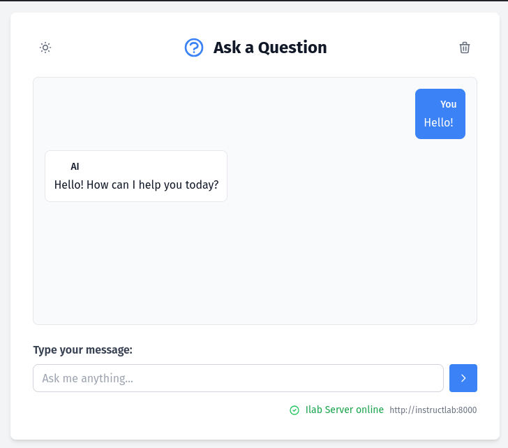

# iLab Client

[](LICENSE)
[](https://python.org)
[](https://flask.palletsprojects.com/)

A Flask web application that serves as a client interface for interacting with AI language model APIs. Provides both a user-friendly web interface and RESTful API endpoints for programmatic access.

## Overview

This application is a Flask-based web client that provides an interface for interacting with AI language model APIs. It consists of two main components working together to deliver a seamless user experience.

### Technologies Used

- **Backend**: Flask (Python 3.10+)
- **Frontend**: HTML5 with Tailwind CSS
- **Container**: Docker/Podman support
- **Orchestration**: Kubernetes with Istio service mesh compatibility
- **API Protocol**: OpenAI-compatible format



### Architecture

The application follows a simple proxy architecture:

#### Components
1. **Web Interface** (`templates/index.html`)
   - Single-page application built with Tailwind CSS
   - Provides real-time question/answer interface
   - Responsive design for multiple device types

2. **API Proxy** (`app.py`)
   - Flask server that proxies requests to external AI services
   - Exposes `/api/completions` endpoint
   - Forwards requests to AI service's `/v1/completions` endpoint
   - Handles OpenAI-compatible API format

#### Data Flow
```
User → Web Interface → Flask App → AI Service (OpenAI-compatible)
                    ↓
              API Response ← AI Service Response
```

#### Key Features
- **Health Checks**: Built-in liveness and readiness probes
- **Resource Management**: Configurable CPU and memory limits
- **Service Mesh Ready**: Istio compatible with traffic management
- **Environment Configuration**: Flexible AI service endpoint configuration

## How to Build

### Local Development with Virtual Environment

#### Prerequisites
- Python 3.10 or higher
- pip package manager

#### Setup Instructions

1. **Create and activate virtual environment**
   ```bash
   python3 -m venv venv
   source venv/bin/activate  # On Windows: venv\Scripts\activate
   ```

2. **Install dependencies**
   ```bash
   pip install -r requirements.txt
   ```

3. **Configure environment**
   ```bash
   export ADDRESS="http://127.0.0.1:8000"  # Replace with your AI service URL
   ```

4. **Run the application**
   ```bash
   python app.py
   ```

The application will be available at `http://localhost:5000`

### Container Build with Podman

#### Prerequisites
- Podman installed and configured

#### Build and Run Instructions

1. **Build the container image**
   ```bash
   podman build -t ilab-client .
   ```

2. **Run the container**
   ```bash
   export ADDRESS="http://your-ai-service:8000"  # Configure your AI service URL
   podman run -d -p 5000:5000 -e ADDRESS="$ADDRESS" --name ilab-client ilab-client
   ```

3. **Access the application**
   Open your browser to `http://localhost:5000`

4. **Stop and remove container**
   ```bash
   podman stop ilab-client
   podman rm ilab-client
   ```

## Kubernetes Deployment

This section explains how to deploy the application to a Kubernetes cluster using the provided manifest files.

### Prerequisites
- Kubernetes cluster with `kubectl` configured
- The `instructlab` service running on port 8080 in the target namespace

### Deployment Steps

1. **Create the namespace**
   ```bash
   kubectl create namespace ilab-chat
   ```

2. **Deploy the application manifests**
   ```bash
   # Deploy the application
   kubectl apply -f manifests/deployment.yaml
   
   # Deploy the service
   kubectl apply -f manifests/service.yaml
   ```

3. **Verify the deployment**
   ```bash
   # Check pod status
   kubectl get pods -n ilab-chat
   
   # Check service status
   kubectl get services -n ilab-chat
   
   # Check deployment details
   kubectl describe deployment ilab-client -n ilab-chat
   ```

4. **Access the application**
   ```bash
   # Get the external IP (for LoadBalancer service)
   kubectl get service ilab-client-service -n ilab-chat
   
   # If using port-forward for testing
   kubectl port-forward service/ilab-client-service 5000:5000 -n ilab-chat
   ```

### Important Notes

⚠️ **Required Service Dependency**: The application expects a service named `instructlab` to be available on port `8080` within the same namespace (`ilab-chat`). This service should provide the AI language model API that the client will proxy requests to.

The deployment configuration automatically sets the `ADDRESS` environment variable to `http://instructlab:8000` as seen in the deployment manifest.

### Manifest Files Description

- **`manifests/deployment.yaml`**: 
  - Defines the application deployment with 1 replica
  - Configures resource limits (256Mi memory, 200m CPU)
  - Sets up health checks (liveness and readiness probes)
  - Points to the `instructlab:8000` service

- **`manifests/service.yaml`**: 
  - Creates a LoadBalancer service
  - Exposes the application on port 5000
  - Provides external access to the web interface

### Troubleshooting

If pods are not starting or are in CrashLoopBackOff:

1. **Check pod logs**
   ```bash
   kubectl logs deployment/ilab-client -n ilab-chat
   ```

2. **Verify instructlab service exists**
   ```bash
   kubectl get service instructlab -n ilab-chat
   ```

3. **Test connectivity to instructlab service**
   ```bash
   kubectl run debug --rm -it --image=curlimages/curl -n ilab-chat -- sh
   # Inside the pod: curl http://instructlab:8000/v1/completions
   ```

## License

This project is licensed under the Apache License 2.0. See the [LICENSE](LICENSE) file for details.

---

**Maintainer**: Rafael Zago  
**Repository**: https://github.com/rafaelvzago/ilab-client  
**Issues**: https://github.com/rafaelvzago/ilab-client/issues
